# LA_COMANDA_CEN-2024

Proyecto grupal para práctica profesional supervisada 2024

# Comanda CEN 🍱

Este proyecto se desarrolló en el marco de la materia _Práctica Profesional Supervisada (PPS)_ de la carrera _Técnico Universitario en Programación_ de la _Universidad Tecnológica Nacional (UTN)_. El objetivo es crear una aplicación para gestionar las diferentes áreas de un restaurante.

## 🧑‍💻 Perfiles de los Desarrolladores

- α [Cristian Corsa](https://github.com/corsa144)
- β [Nicolás Miguenz](https://github.com/nmiguenz)
- γ [Ezequiel Monson](https://github.com/EzequielMonson)

## 📝 Responsabilidades

### Semana 1

| _Responsabilidad_       | _Cristian Corsa (α)_ | _Nicolás Miguenz (β)_                                                                          | _Ezequiel Monson (γ)_                     |
| ----------------------- | -------------------- | ---------------------------------------------------------------------------------------------- | ----------------------------------------- |
| _Módulos asignados_     | Alta de mesas.       | Splash screen e ícono  Ingreso, registro de clientes (generales y anónimos), autenticación. | Registro de dueño/supervisor y empleados. |
| _Fecha de inicio_       | 30/10/2024           | 30/10/2024                                                                                     | 30/10/2024                                |
| _Fecha de finalización_ | 08/11/2024           | 08/11/2024                                                                                     | 08/11/2024                                |
| _Rama (Branch)_         | feature/alta-mesa    | nmiguenz                                                                                       | ezemonson                                 |

### Semana 2

| _Responsabilidad_       | _Cristian Corsa (α)_                            | _Nicolás Miguenz (β)_                                                                | _Ezequiel Monson (γ)_ |
| ----------------------- | ----------------------------------------------- | ------------------------------------------------------------------------------------ | --------------------- |
| _Módulos asignados_     | Sonidos y vibración en error.  Home del mozo | Listas de espera pendiente aprobación y metre  Consulta  Spinner de la empresa | Alta de productos     |
| _Fecha de inicio_       | 9/11/2024                                       | 9/11/2024                                                                            | 9/11/2024             |
| _Fecha de finalización_ | 15/11/2024                                      | 15/11/2024                                                                           | 15/11/2024            |
| _Rama (Branch)_         | feature/alta-mesa                               | nmiguenz                                                                             | ezemonson             |

### Semana 3

| _Responsabilidad_       | _Cristian Corsa (α)_            | _Nicolás Miguenz (β)_                                                                                                                      | _Ezequiel Monson (γ)_                                                             |
| ----------------------- | ------------------------------- | ------------------------------------------------------------------------------------------------------------------------------------------ | --------------------------------------------------------------------------------- |
| _Módulos asignados_     | Metre asigna mesa.  Encuesta | Cliente se une a la mesa  Push notifications y mails  Gestión de pedidos del lado del mozo  cocinero y bartender finalizan pedido | Carta y gestión de pedidos del lado del cliente.  Manejo del estado del pedido |
| _Fecha de inicio_       | 16/11/2024                      | 16/11/2024                                                                                                                                 | 16/11/2024                                                                        |
| _Fecha de finalización_ | 22/11/2024                      | 22/11/2024                                                                                                                                 | 22/11/2024                                                                        |
| _Rama (Branch)_         | feature/alta-mesa               | nmiguenz                                                                                                                                   | ezemonson                                                                         |

### Semana 4

| _Responsabilidad_       | _Cristian Corsa (α)_  | _Nicolás Miguenz (β)_                                                         | _Ezequiel Monson (γ)_                                  |
| ----------------------- | --------------------- | ----------------------------------------------------------------------------- | ------------------------------------------------------ |
| _Módulos asignados_     | Encuesta y resultados | Finalización del circuito de pedido (mozo)  Detalle de la mesa  Reserva | Finalización del circuito de pedido (Cliente)  Pago |
| _Fecha de inicio_       | 23/11/2024            | 23/11/2024                                                                    | 23/11/2024                                             |
| _Fecha de finalización_ | 29/11/2024            | 29/11/2024                                                                    | 29/11/2024                                             |
| _Rama (Branch)_         | feature/alta-mesa     | nmiguenz                                                                      | ezemonson                                              |

## 📱 ¿Cómo utilizar la Comanda CEN?

### Inicio de sesión

Cualquier de los usuarios aceptados por el sistema (Dueño/Supervisor, Empleados, Clientes) pueden utilizar esta forma de ingreso, indistintamente, ya que al ingresar, el Sistema determinará de qué tipo de perfil se trata.

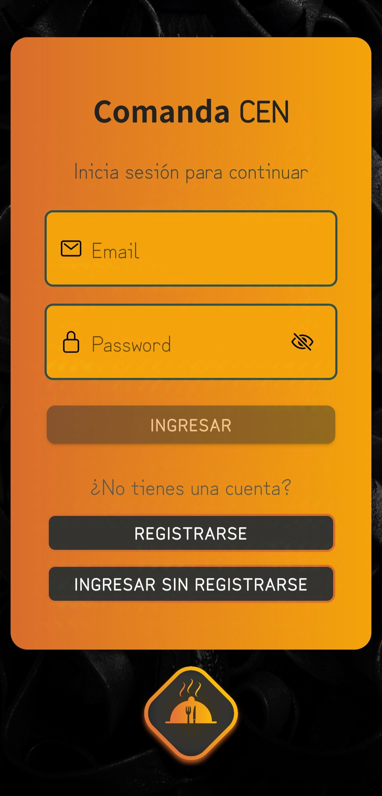

### Registros

En la apliación existen varios tipos de registros, para un cliente, para empleados, supervisores o dueños y para clientes anónimos. La diferencia de estos últimos con el cliente, es que no podrán contar con beneficios tales como reservar o realizar encuestas.

#### Cliente

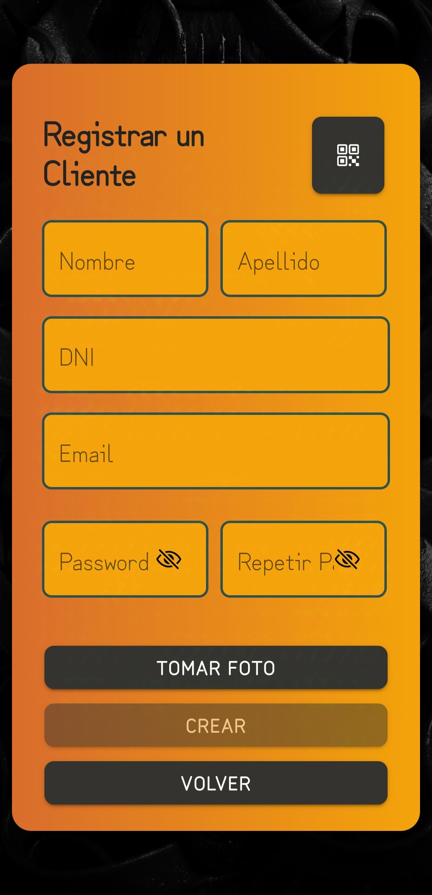

#### Cliente anónimo

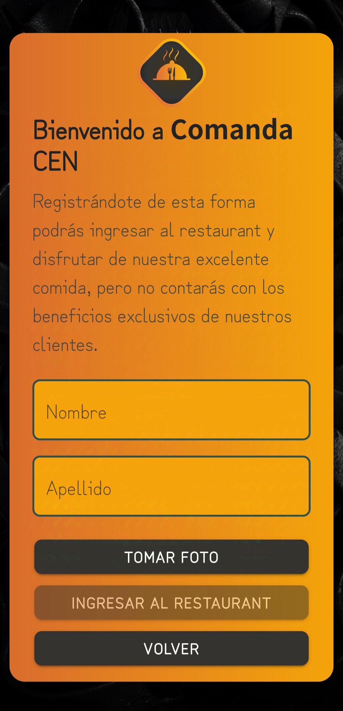

#### Empleados / Dueño-Supervisor

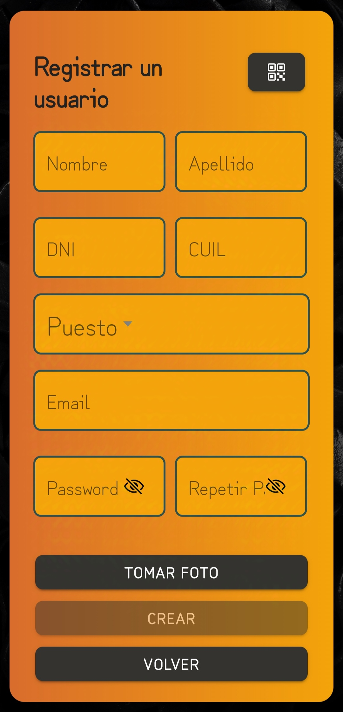

### Home del cliente

Una vez que el cliente ingresa a la aplicación, podrá realizar una reserva futura o escanear el QR (ver más abajo) de la lista de espera y esperar a que el metre lo acepte (o no) y le asigne automaticamente una mesa.

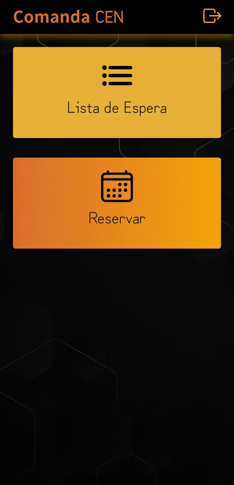

Una vez aceptado por el metre, el cliente verá otro diseño en la pantalla desde el que podrá escanear QR, para ver el estado del pedido o habilitar las encuestas según el momento, realizar pedidos, consultar al mozo y demás.

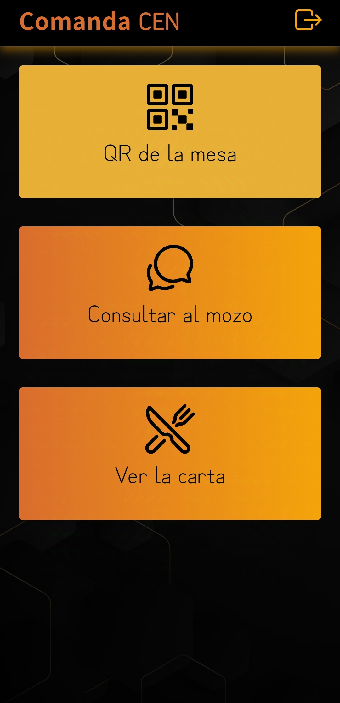

### 🛒 Carta del restaurante y pedido

Una vez con la mesa en su poder, el cliente podrá realizar pedidos ingresando en la Carta. En la misma podrá presionar cualquiera de los productos y ver su detalle junto con el botón de "Agregar" al pedido, como así también un detalle del pedido previo a la confirmación.

#### Carta

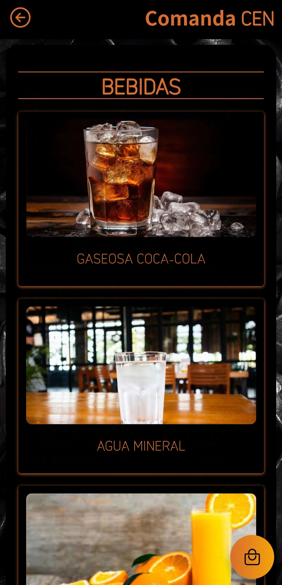

#### Detalle producto

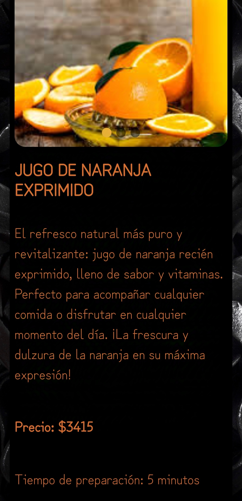

#### Pedido

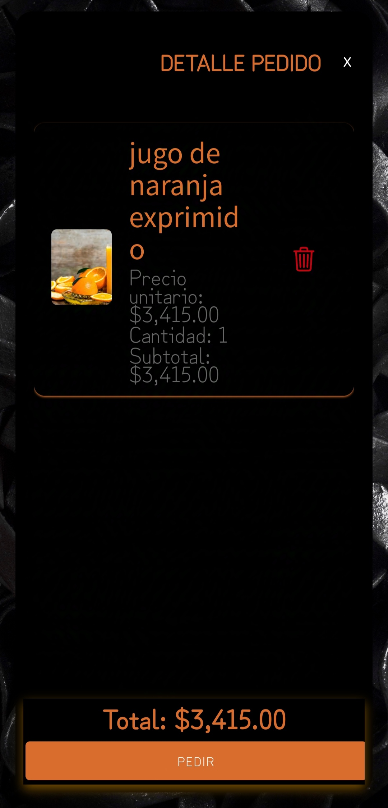

### 📨 Consultas

Cuando el cliente tenga alguna inquietud, podrá realizarle una consulta a los mozos, quienes serán notificados mediante un mensaje de tipo push.

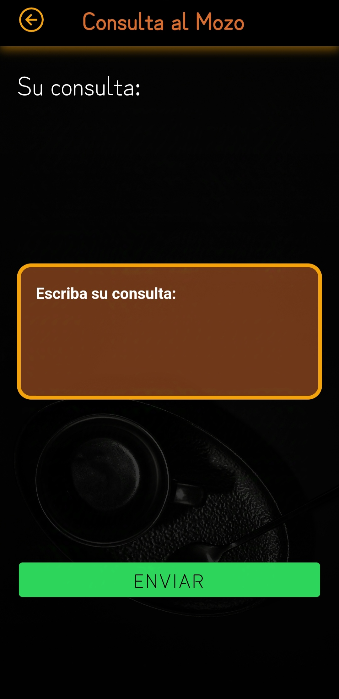

### 📝 Encuesta

Con el pedido en su poder, el cliente podrá escanear el código QR de su mesa y habilitar las encuestas, donde podrá detallar el grado de satisfacción y excelencia de la Comanda CEN.

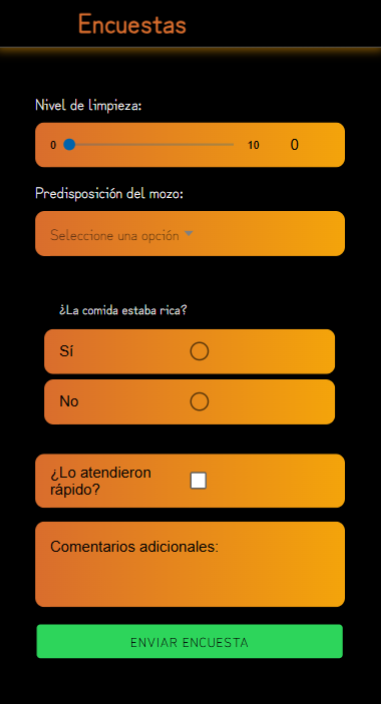

### ⏰ Reserva

El cliente, cuando no es anónimo, podrá realizar reservas para un tiempo futuro, pero hay que tener en cuenta de Comanda CEN solo abre de martes a domingo de 11:00-15:00 y de 19:00 a 24:00, por lo que solo se podrán realizar reservas dentro de este tiempo. Además si estás dentro del horario de tu reserva y te presentas en el restaurante, automaticamente se te pondrá en la lista para obtener la mesa que reservaste, pero si llegas pasado el tiempo, se te cancelará utomaticamente. Esperamos que nos entiendas!.

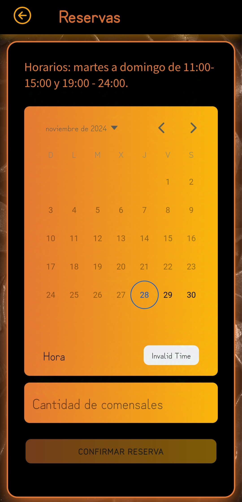

## 📊 QRs

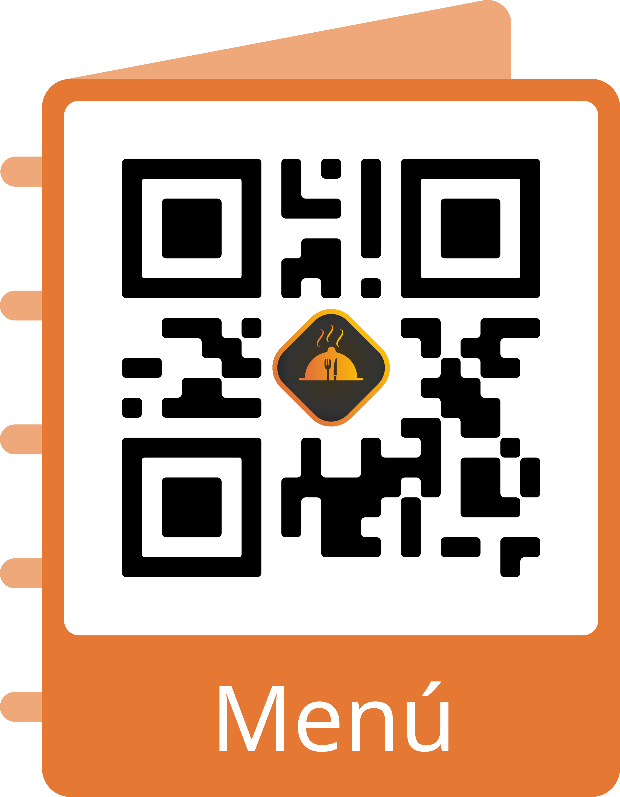
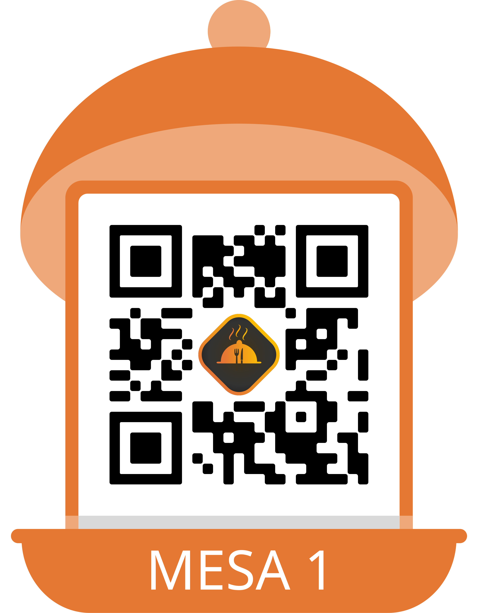
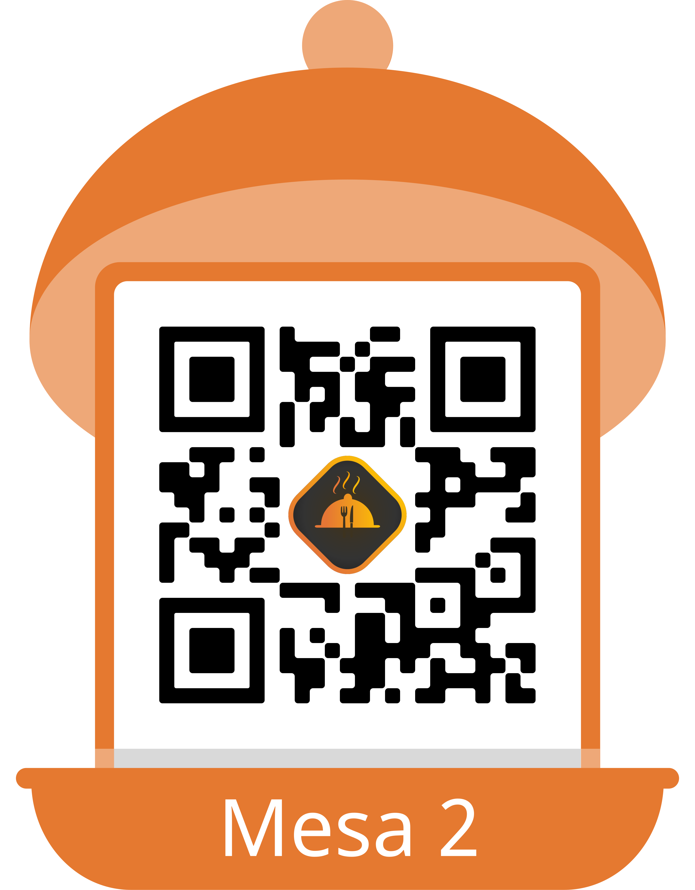

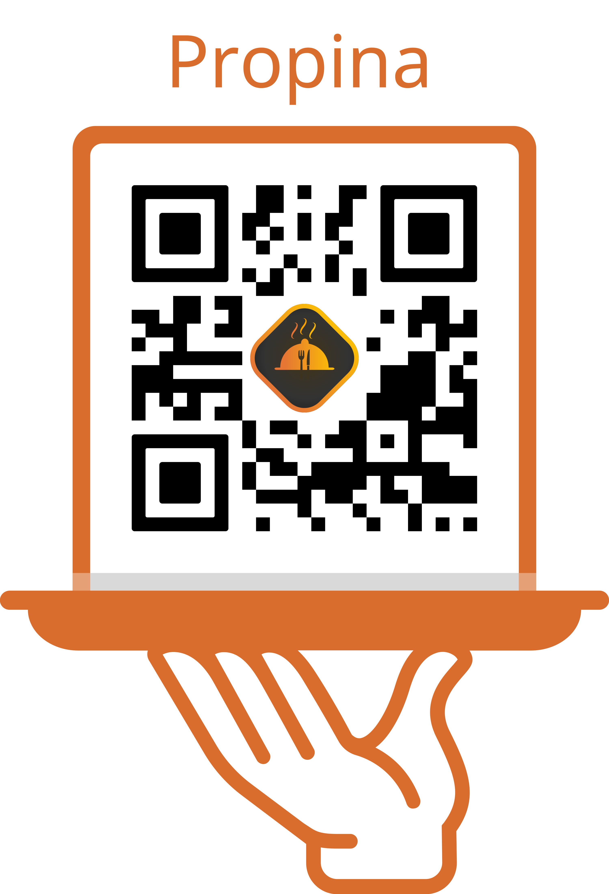
