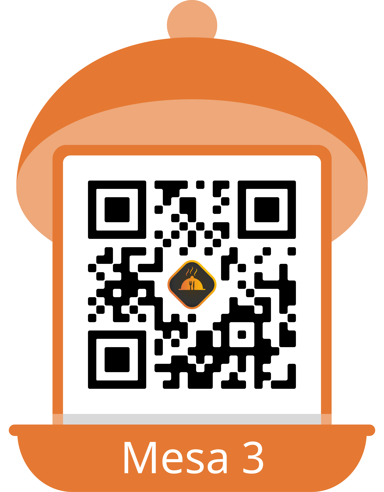

# LA_COMANDA_CEN-2024
Proyecto grupal para práctica profesional supervisada 2024

# Comanda CEN 🍱

Este proyecto se desarrolló en el marco de la materia *Práctica Profesional Supervisada (PPS)* de la carrera *Técnico Universitario en Programación* de la *Universidad Tecnológica Nacional (UTN)*. El objetivo es crear una aplicación para gestionar las diferentes áreas de un restaurante.

## 🧑‍💻 Perfiles de los Desarrolladores

- α [Cristian Corsa](https://github.com/corsa144)
- β [Nicolás Miguenz](https://github.com/nmiguenz)
- γ [Ezequiel Monson](https://github.com/EzequielMonson)

## 📝 Responsabilidades

| *Responsabilidad*             | *Cristian Corsa (α)*       | *Nicolás Miguenz (β)*      | *Ezequiel Monson (γ)*    |
|---------------------------------|----------------------------|----------------------------|----------------------------|
| *Módulos asignados*           | Alta de mesas              | Splash screen e ícono  Ingreso, registro de clientes, autenticación | Registro de dueño/supervisor y empleados |
| *Fecha de inicio*             | 30/10/2024                 | 30/10/2024                 | 30/10/2024                 |
| *Fecha de finalización*       | 08/11/2024                 | 08/11/2024                 | 08/11/2024                 |
| *Rama (Branch)*               | feature/alta-mesa          | nmiguenz                    | ezemonson                |
| *Módulos asignados*           | sonidos y vibraciones de la app | Se agrega la visualización de la lista de espera por el metre | Registro de dueño/supervisor y empleados |
| *Fecha de inicio*             | 10/11/2024                 | 8/11/2024                 | 10/11/2024                 |
| *Fecha de finalización*       | 13/11/2024                 | 13/11/2024                 | 13/11/2024                 |
| *Rama (Branch)*               | feature/sonido-vibracion   | nmiguenz                    | ezemonson                |
| *Módulos asignados*           | mozo-home             | Consulta-cliente y componente loading|  alta de producto     |
| *Fecha de inicio*             | 14/11/2024                 | 14/11/2024                 | 14/11/2024                 |
| *Fecha de finalización*       | 16/11/2024                 | 16/11/2024                 | 16/11/2024                 |
| *Rama (Branch)*               | feature/mozo-home        | nmiguenz                 | ezemonson                |
| *Módulos asignados*           | metre-lista-espera            | mails y push notification | carta y gestion de pedidos |
| *Fecha de inicio*             | 14/11/2024                 | 14/11/2024                 | 14/11/2024                 |
| *Fecha de finalización*       | 16/11/2024                 | 16/11/2024                 | 16/11/2024                 |
| *Rama (Branch)*               | feature/metre-lista-espera        | nmiguenz                 | ezemonson                |
| *Módulos asignados*           | encuesta-cliente             | pedido-cliente  | empleado-home |
| *Fecha de inicio*             | 19/11/2024                 | 19/11/2024                 | 19/11/2024                 |
| *Fecha de finalización*       | 21/11/2024                 | 20/11/2024                 | 20/11/2024                 |
| *Rama (Branch)*               | feature/encuesta-cliente        | nmiguenz                 | ezemonson                |
| *Módulos asignados*           | listado-encuesta             | reservas                  | manejo del pago de pedido              |
| *Fecha de inicio*             | 24/11/2024                 | 24/11/2024                 | 24/11/2024                 |
| *Fecha de finalización*       | 26/11/2024                 | 26/11/2024                 | 26/11/2024                 |
| *Rama (Branch)*               | feature/graficos        | nmiguenz                 | ezemonson                |

#qrs

